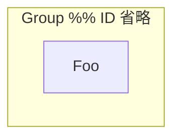
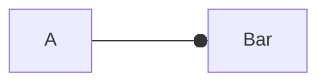
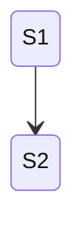
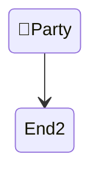
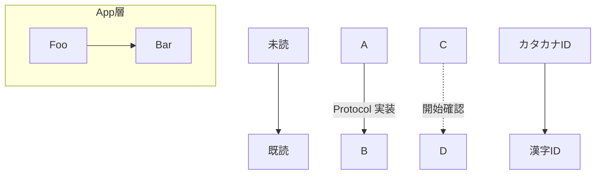
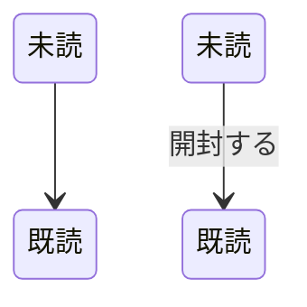
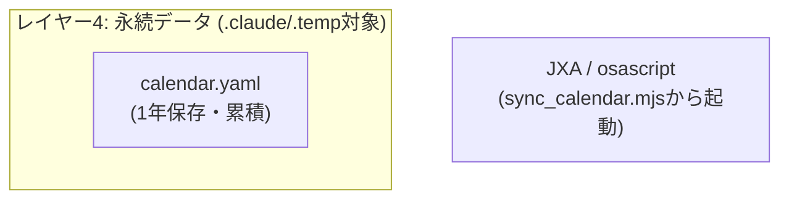
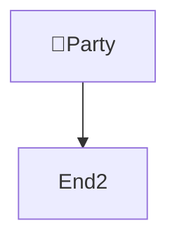

# lint_mermaid.py 検出テスト用フィクスチャ

保守用。各検査が実際に発火することを確認する。
期待値は **NG 7 件 / WARN 1 件**、終了コード 1。

```bash
../scripts/lint_mermaid.py fixture.md
```

検査を足したらここにケースを足す。誤検出の回帰確認には、代わりに
`../../mermaid-diagram/SKILL.md` と `../../mermaid-diagram/common-errors.md`
を掛ける（正しい図だけが入っているので NG 0 件になること）。

## 1. flowchart: lowercase end（NG end を期待）

```mermaid
flowchart LR
    Start --> end
```

## 2. flowchart: 行末 %% コメント（NG comment を期待）

コメント本文の日本語をノード ID として二重報告しないことも同時に確認する。



## 3. flowchart: Note キーワード（NG note を期待）

```mermaid
flowchart TD
    A[Foo]
    Note right of A: memo
```

## 4. flowchart: o/x エッジ（WARN ox-edge を期待）



## 5. stateDiagram: 行末 %% コメント（公式が許すので何も出ない）



## 6. flowchart: 絵文字を含む素のノード ID（NG lexical を期待）

```mermaid
flowchart TD
    🎉Party --> End2
```

## 7. stateDiagram: 絵文字を含む素の状態 ID（NG lexical を期待）



## 7b. flowchart: 矢印記号を含む素のノード ID（NG lexical を期待。絵文字以外の Symbol カテゴリ文字も対象）

```mermaid
flowchart TD
    A→B --> C
```

## 7c. flowchart: 数学記号を含む素のノード ID（NG lexical を期待。mermaid-js issue #4050 のトリガー文字）

```mermaid
flowchart TD
    f∘g --> C
```

## 8. CJK は未クォートでも何も出ない（github_render_verification.md で実地検証済み、回帰確認）





## 9. クォート済みラベル内の括弧（何も出ない。誤検出の回帰確認）

クォート済みラベルの中に `(...)` を含む場合、その括弧内を未クォートの
丸ノードラベルとして誤検出しないことを確認する。



## 10. 絵文字もクォートすれば何も出ない


