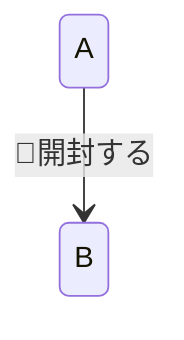
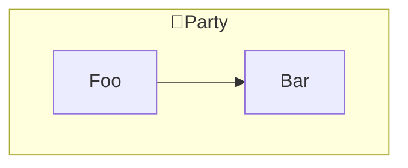
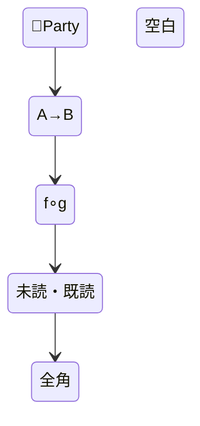
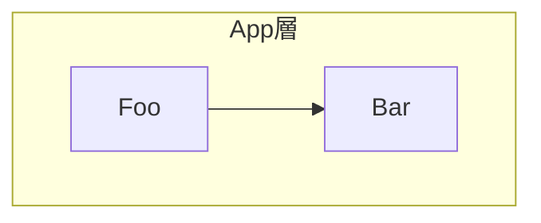
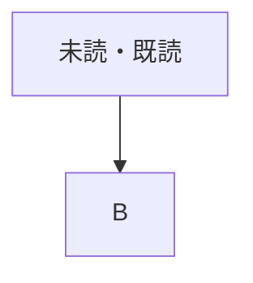
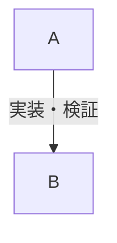

# Mermaid レンダリング実地検証用フィクスチャ

`mermaid-lint` の文字カテゴリ関連ルールを、実パーサと GitHub レンダラーで切り分けるための資料。
検証の手順そのものは `../docs/verification-methodology.md` を参照。本ファイルはその手順を
適用した結果の記録。

## 検証方法

### 実パーサ（ルール判定の主な根拠）

mermaid 11.16.0 と jsdom を使い、DOM と `getBBox()` 等を用意したうえで
`mermaid.render()` まで実行した。`mermaid.parse()` だけでなくレイアウト処理まで通している。
文字カテゴリを網羅的に比較でき、同じバージョンで再現できるため、一般的な構文・lexer 挙動は
この結果を根拠とする。

### GitHub レンダラー（GitHub 固有挙動の確認）

このファイルを GitHub.com 上で直接開き、各セクションの図が
「Unable to render rich display」になるかを目視確認する。GitHub の Mermaid
バージョンは固定・公開されていないため、btoa 等の GitHub 固有差分を疑う場合に使う。
実パーサの結果と GitHub の結果を混同しない。

**確認済み（ラウンド1、2026-07）**: いずれも未クォートで問題なし。

- flowchart の素の非 ASCII ノード ID（`未読 --> 既読`）
- flowchart の素の非 ASCII subgraph ID（`subgraph App層`）
- stateDiagram-v2 の素の非 ASCII 状態 ID
- stateDiagram-v2 の非 ASCII 遷移ラベル
- flowchart のドット付きリンクの未クォート CJK ラベル（`-. text .->`）
- flowchart の未クォート CJK ノードラベル（`[...]` 内）・パイプラベル（`|...|`）
- クォート済みの数学記号ラベル（mermaid-js issue #4050 の再現、`∘` は Latin-1 範囲外）

**確認済み（ラウンド1、2026-07）**: 絵文字（サロゲートペア文字）を素のノード ID に使うと `Lexical error` になる（`btoa` エラーではない）。`lint_mermaid.py` の `lexical` チェックはこれに対応する。

**確認済み（ラウンド2、2026-08、mermaid 11.16.0 `render()`）**:

| ケース | 内容                                            | 結果            |
| ------ | ----------------------------------------------- | --------------- |
| 1      | flowchart: 絵文字を含む素の subgraph ID         | `Lexical error` |
| 2      | stateDiagram-v2: 絵文字を含む遷移ラベル         | OK              |
| 3      | flowchart: 素の ID の矢印記号 `→`               | `Lexical error` |
| 4      | flowchart: 素の ID の数学記号 `∘`               | `Lexical error` |
| 4b     | flowchart: 素の ID の句読点 `・` (Po)           | `Lexical error` |
| 4c     | flowchart: 素の ID の全角数字 `０` (Nd)         | `Lexical error` |
| 5      | flowchart: クォートした絵文字 subgraph タイトル | OK              |
| 6      | stateDiagram-v2: 記号等を含む素の状態 ID        | OK              |

追加の位置別検証:

| ケース                                                 | 結果            |
| ------------------------------------------------------ | --------------- |
| flowchart: 素の subgraph ID に CJK (`subgraph App層`)  | OK              |
| flowchart: 素の subgraph ID に Po (`subgraph App・層`) | `Lexical error` |
| flowchart: 未クォートノードラベル `[未読・既読]`       | OK              |
| flowchart: 未クォートパイプラベル `                    | 実装・検証      |
| flowchart: 未クォートノードラベル `[未読(初期)]`       | `Parse error`   |

素の node / subgraph ID は Letter 以外の非 ASCII 文字がエラーになる一方、ラベル位置では
Po も使用できる。ラベルを壊す ASCII の構文文字とは別問題である。また stateDiagram-v2 は
同じ lexical 制約を持たない。

## 1. flowchart: 絵文字を含む素の subgraph ID

```mermaid
flowchart TD
    subgraph 🎉Party
        Foo --> Bar
    end
```

## 2. stateDiagram-v2: 絵文字を含む遷移ラベル



## 3. flowchart: 素の識別子に使った矢印記号（CJK でも絵文字でもない Unicode 記号、BMP 内）

```mermaid
flowchart TD
    A→B --> C
```

## 4. flowchart: 素の識別子に使った数学記号（issue #4050 のトリガー文字、BMP 内・未クォート）

```mermaid
flowchart TD
    f∘g --> C
```

## 4b. flowchart: 素の識別子に使った句読点（Po）

```mermaid
flowchart TD
    未読・既読 --> C
```

## 4c. flowchart: 素の識別子に使った全角数字（Nd）

```mermaid
flowchart TD
    状態０ --> C
```

## 5. 比較用: 絵文字を含む subgraph タイトルをクォートした場合（問題ない想定）



## 6. stateDiagram-v2: 記号等を含む素の状態 ID



## 7. flowchart: 素の subgraph ID に CJK



## 8. flowchart: 素の subgraph ID に句読点（Po）

```mermaid
flowchart TD
    subgraph App・層
        Foo --> Bar
    end
```

## 9. flowchart: 未クォートノードラベルに句読点（Po）



## 10. flowchart: 未クォートパイプラベルに句読点（Po）



## 11. flowchart: 未クォートノードラベルに ASCII の構文文字

```mermaid
flowchart TD
    A[未読(初期)] --> B
```
