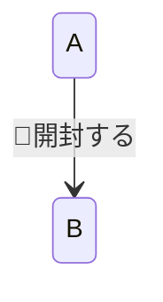
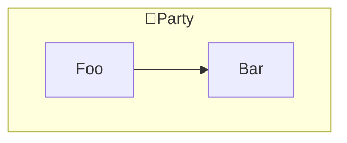
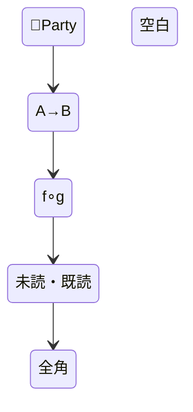

# GitHub レンダリング実地検証用フィクスチャ

`mermaid-lint` の btoa 系ルールのうち、根拠が推測ベースだったものを実地検証するための資料。

**使い方**: このファイルを GitHub.com 上で直接開き（`https://github.com/<org>/<repo>/blob/<branch>/plugins/mermaid/skills/mermaid-lint/fixtures/github_render_verification.md`）、各セクションの図が「Unable to render rich display」エラーなく描画されるかを目視確認する。

**確認済み（ラウンド1、2026-07）**: いずれも未クォートで問題なし。

- flowchart の素の非 ASCII ノード ID（`未読 --> 既読`）
- flowchart の素の非 ASCII subgraph ID（`subgraph App層`）
- stateDiagram-v2 の素の非 ASCII 状態 ID
- stateDiagram-v2 の非 ASCII 遷移ラベル
- flowchart のドット付きリンクの未クォート CJK ラベル（`-. text .->`）
- flowchart の未クォート CJK ノードラベル（`[...]` 内）・パイプラベル（`|...|`）
- クォート済みの数学記号ラベル（mermaid-js issue #4050 の再現、`∘` は Latin-1 範囲外）

**確認済み・唯一の実在問題（ラウンド1、2026-07）**: 絵文字（サロゲートペア文字）を素のノード ID に使うと `Lexical error` になる（`btoa` エラーではない）。`lint_mermaid.py` の `lexical` チェックはこれに対応する。

**確認済み（ラウンド2、2026-08）**:

- flowchart の素の subgraph / node ID に絵文字・矢印・数学記号を使うと `Lexical error`
- stateDiagram-v2 の遷移ラベルと素の状態 ID では同じ文字を使用可能
- クォート済みの flowchart subgraph タイトルでは使用可能

stateDiagram-v2 の状態 ID は Mermaid 11.16.0 の `mermaid.render()` でも、GitHub 上の
[Issue #1](https://github.com/BlueEventHorizon/mermaid-plugin/issues/1) でも描画を確認した。
flowchart と stateDiagram-v2 は同じ lexical 制約を持たない。

## 1. flowchart: 絵文字を含む素の subgraph ID

```mermaid
flowchart TD
    subgraph 🎉Party
        Foo --> Bar
    end
```

## 2. stateDiagram-v2: 絵文字を含む遷移ラベル



## 3. flowchart: 素の識別子に使った矢印記号（CJK でも絵文字でもない Unicode 記号、BMP 内）

```mermaid
flowchart TD
    A→B --> C
```

## 4. flowchart: 素の識別子に使った数学記号（issue #4050 のトリガー文字、BMP 内・未クォート）

```mermaid
flowchart TD
    f∘g --> C
```

## 5. 比較用: 絵文字を含む subgraph タイトルをクォートした場合（問題ない想定）



## 6. stateDiagram-v2: 記号等を含む素の状態 ID


