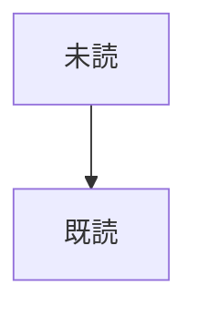
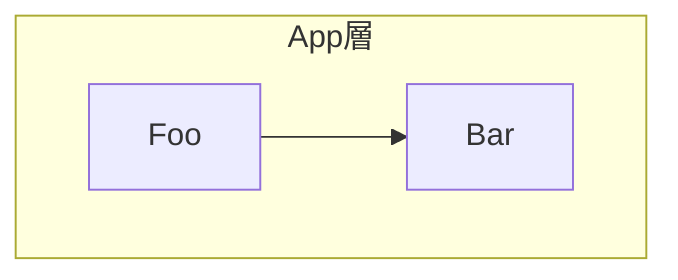
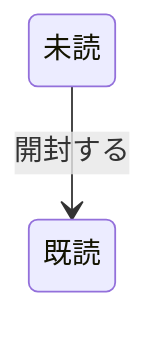
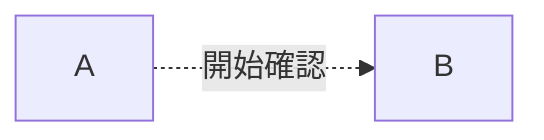
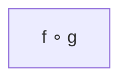
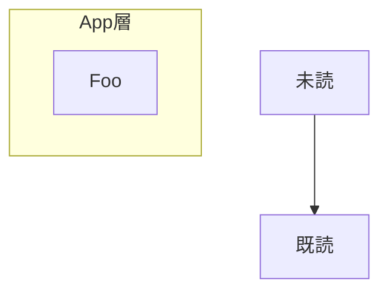

# GitHub レンダリング実地検証用フィクスチャ

`mermaid-lint` の btoa 系ルールのうち、根拠が推測ベースだったものを実地検証するための資料。

**使い方**: このファイルを GitHub.com 上で直接開き（`https://github.com/<org>/<repo>/blob/<branch>/plugins/mermaid/skills/mermaid-lint/scripts/github_render_verification.md`）、各セクションの図が「Unable to render rich display」エラーなく描画されるかを目視確認する。

**既に確認済み**（削除済みルールの根拠。参考として記録）:
- flowchart の未クォート CJK ノードラベル（`[...]` 内）→ 問題なし
- flowchart の未クォート CJK パイプラベル（`|...|`）→ 問題なし
- flowchart の未クォート CJK ドット付きリンクラベル（`-. text .->`）→ 未クォートラベル一般が問題ないなら同様に問題ないはず（要確認）

**今回検証する項目**:

## 1. flowchart: 素の非 ASCII ノード ID



## 2. flowchart: 素の非 ASCII subgraph ID



## 3. stateDiagram-v2: 素の非 ASCII 状態 ID


## 4. stateDiagram-v2: 非 ASCII 遷移ラベル



## 5. flowchart: ドット付きリンクの未クォート CJK ラベル（今回追加したルールの根拠確認）



## 6. flowchart: 絵文字を含む素のノード ID

```mermaid
flowchart TD
    🎉Party --> End2
```

## 7. flowchart: クォート済みの数学記号ラベル（mermaid-js issue #4050 の再現、`∘` は Latin-1 範囲外）



## 8. 比較用: すべてクォート済み・delimiter 内ラベル（問題ない想定の対照群）


